# NutriPlan

Plan a week of healthy eating in minutes, shop from one list, and cook with your hands busy: thirty recipes with honest macros, a weekly board that does the maths, a shopping list that writes itself, and a calorie target that keeps score. Free, private, offline, in English and Arabic.

**Live:** [nutriplan-lf-2.vercel.app](https://nutriplan-lf-2.vercel.app) · **بالعربية:** [nutriplan-lf-2.vercel.app/ar](https://nutriplan-lf-2.vercel.app/ar)

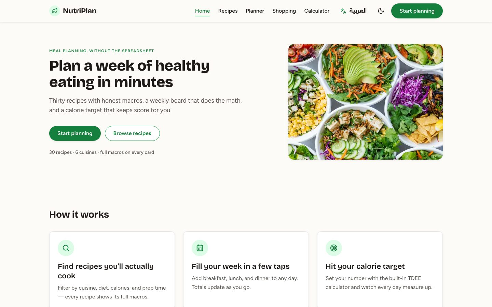

NutriPlan started as a portfolio spec: a recipe browser, a weekly meal board and a calorie calculator. It's now a small, real tool for four moments in a normal week: **Sunday evening** (plan the week, or let *Fill my week* do it to your calories, protein and diet), **in the supermarket** (one merged list, by aisle, that works with no signal), **in the kitchen** (cook mode: one big step at a time, the screen kept on, timers that chime), and **on target** (calories, protein, carbs and fat for every day against your own numbers). Everything the docs specified is still here: the five pages, the 30 recipes and their filters, the servings stepper, the hand-drawn SVG donut and rings, the weekly board and the calculator.

**Stack:** React 19 · Vite 7 · react-router-dom 7 · Tailwind CSS v4 (`@theme` tokens) · Motion · lucide-react · Web Audio · a hand-written service worker. No backend, no accounts, no tracking.

## What people can do with it

| Tool | What it does |
|---|---|
| **Recipes** | 30 recipes across six cuisines, every one with calories, protein, carbs, fat and time. Search titles and ingredients (in either language), filter by cuisine, diet, meal, max calories and max time, keep favorites. Every filter combination is unit-tested against the PRD's rule. |
| **Recipe page** | A servings stepper that rescales every amount, Metric/US units, a step checklist, a hand-drawn macro donut and rings, and *Add to planner* in two taps. |
| **Cook mode** | Full screen, one step at a time in big type. The screen stays on (Wake Lock). Timed steps get timers (several at once) with a soft synthesised chime and a buzz on phones. The scaled ingredients are a tap away. Fully keyboard-operable: ← → steps, Space or T timer, I ingredients, Esc. |
| **Weekly planner** | Monday to Sunday × breakfast, lunch, dinner and snacks, with servings per slot. Each day measures itself against your calories, protein, carbs and fat; a red bar says exactly how far over. Real calendar weeks, copy a day, repeat last week, move or swap meals (keyboard or drag), undo anything, your own meals ("Mum's koshari") with their calories. |
| **Fill my week** | An auto-planner that fills only the empty slots so each day lands within ±5% of your target, respects your diet (vegan, vegetarian, keto; high-protein first), never repeats a dish more than twice a week, and then **shows its working**: every pick, the calories it aimed for, and an honest note when a narrow diet forces repeats. Deterministic, unit-tested, one tap to undo. |
| **Shopping list** | The week's ingredients merged across recipes and servings (850 g chicken breast, not three lines), units normalized, rounded up to what you can buy, grouped by aisle. Tick things off in the store (saved, offline), mark what you already have, add your own extras, share it as text, or print it. |
| **Calculator** | Mifflin-St Jeor BMR and TDEE in metric or US units, explained with your own numbers. Goals of −500, −250, ±0 and +300 kcal with safety built in: never below 1,200 / 1,500 kcal or your BMR, a warning for steep cuts, no weight-loss goals under 18, a note for pregnancy and medical conditions, and a link to [findahelpline.com](https://findahelpline.com). Saves calories and a protein-led macro split to the planner. |
| **Your data** | Everything stays in this browser (`localStorage`, `nutriplan-*`). Download a backup, restore it on another device (it merges), or delete everything in one click. No sign-up, analytics, cookies or third-party requests; even the fonts are self-hosted. |
| **English and العربية** | A toggle that keeps you on the same page, or any address under `/ar`. Arabic is a full right-to-left layout in Alexandria and Readex Pro, written for the page, including all 30 recipes, every step and every ingredient, with proper plurals and counter words. |
| **Evening theme and offline** | A warm dark theme that follows the system (or the moon button). Installable as an app; after one visit the planner, the list, cook mode and every recipe work with no connection. |

## Screenshots

<table>
  <tr>
    <td width="50%">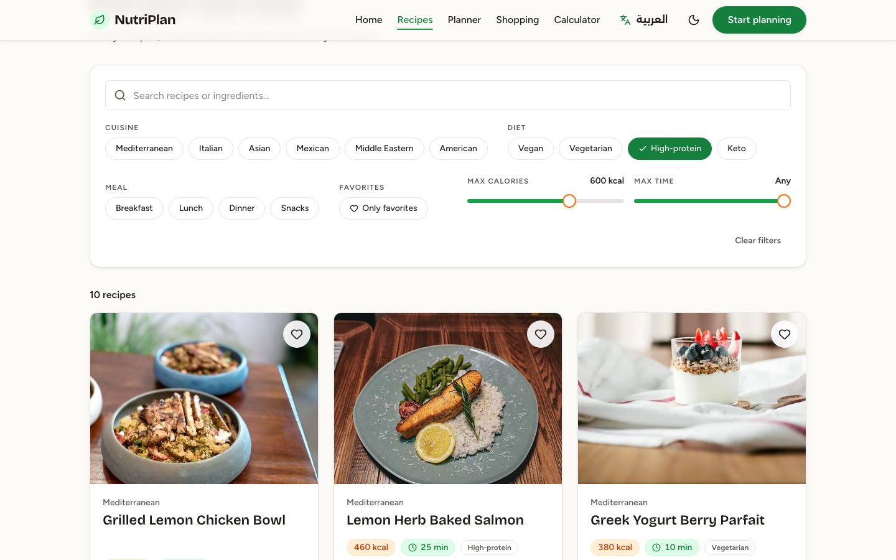 <b>Recipes</b>: search and filters, 10 high-protein dishes under 600 kcal</td>
    <td width="50%">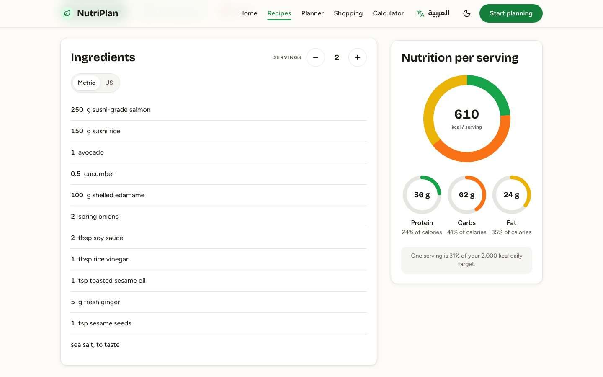 <b>Recipe</b>: servings stepper and the hand-drawn macro donut</td>
  </tr>
  <tr>
    <td width="50%">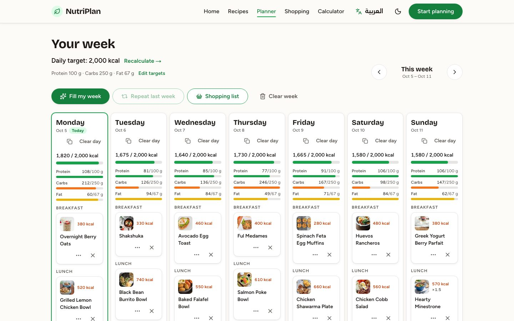 <b>Planner</b>: a full week against calories and macros</td>
    <td width="50%">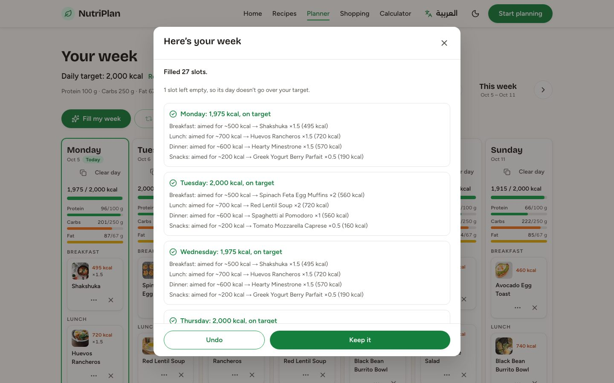 <b>Fill my week</b>: the auto-planner shows its working</td>
  </tr>
  <tr>
    <td width="50%">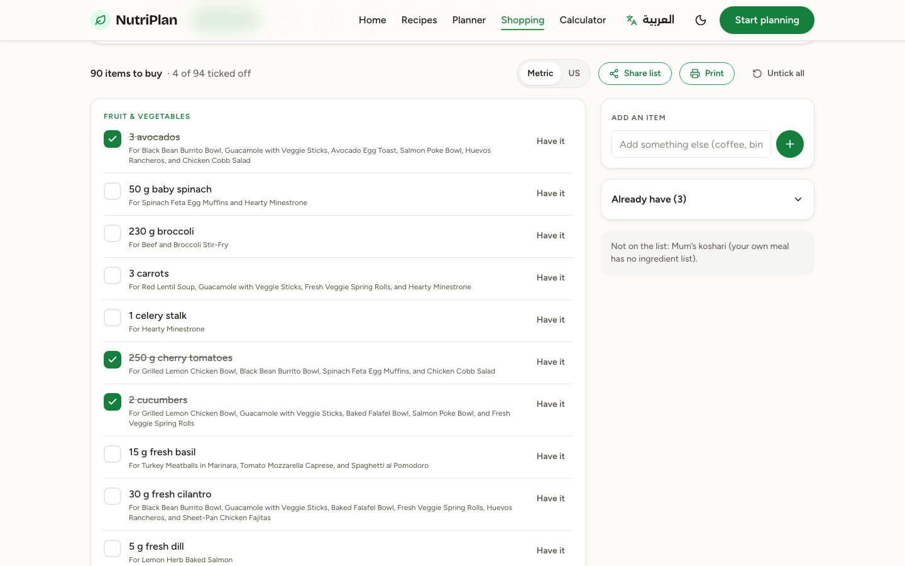 <b>Shopping list</b>: merged by aisle, ticked off in the store</td>
    <td width="50%">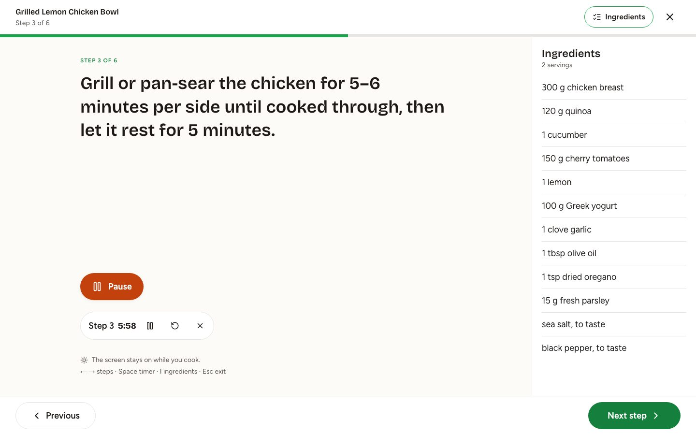 <b>Cook mode</b>: one step at a time, timers, screen kept on</td>
  </tr>
  <tr>
    <td width="50%">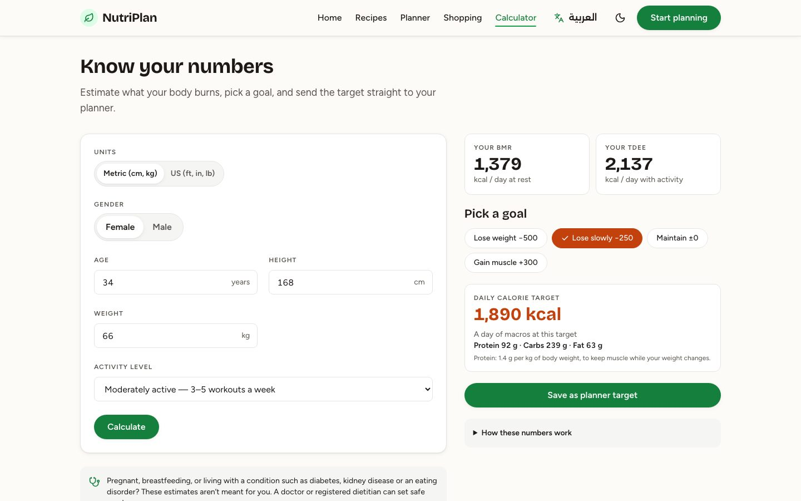 <b>Calculator</b>: BMR/TDEE, gentle goals, macros to the planner</td>
    <td width="50%">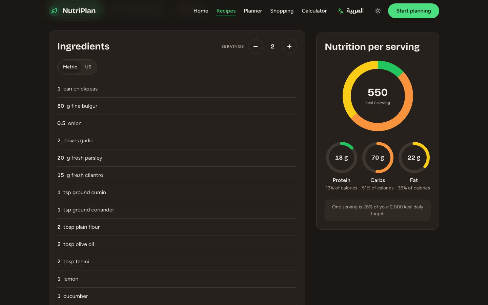 <b>Evening theme</b>: warm and dim, follows the system</td>
  </tr>
  <tr>
    <td width="50%">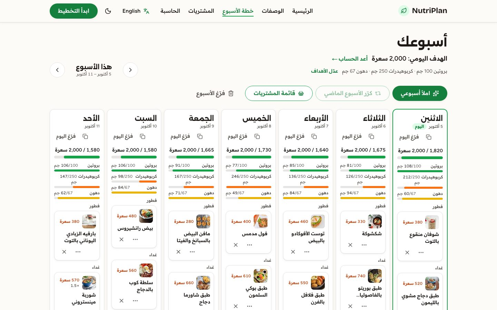 <b>العربية</b>: the planner, right to left</td>
    <td width="50%">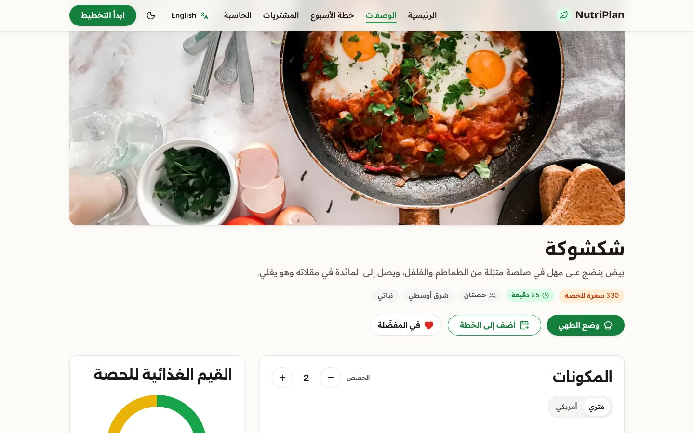 <b>العربية</b>: every recipe, written in Arabic</td>
  </tr>
</table>

  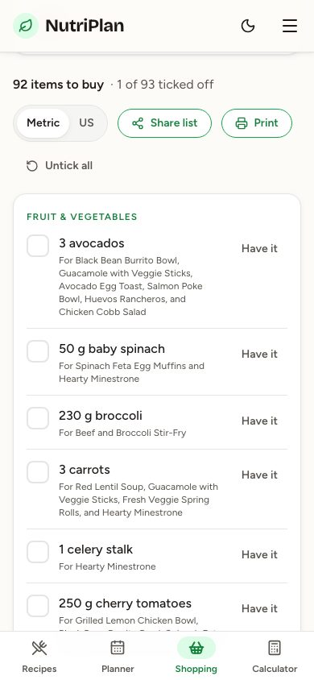
  &nbsp;
  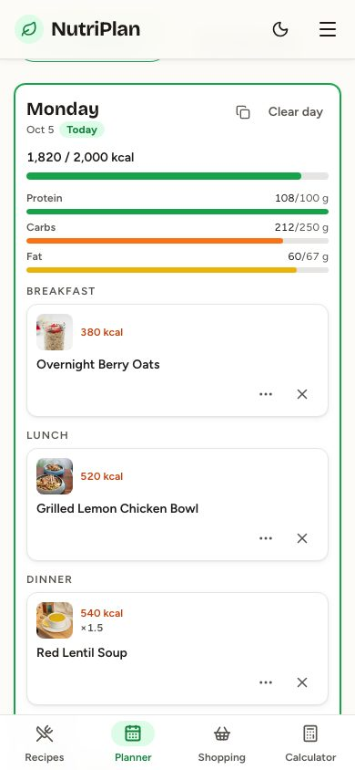
   <b>Mobile</b>: the list in the supermarket, the week on the go

To regenerate them: `SHOTS=1 npx playwright test readme.shots --project=desktop` (also refreshes `public/og.jpg` and the root gallery preview).

## How it's built

- **Every page is static HTML first.** A second Vite build prerenders all 36 routes in both languages (72 pages, every recipe included) with `react-dom/static` and `StaticRouter`; `scripts/prerender.mjs` inlines the CSS, preloads each page's own chunk and fonts, preloads the hero photo, and writes per-page titles, descriptions, hreflang links and Open Graph images. React hydrates; saved data comes in through `useSyncExternalStore`, so hydration always matches and your plan appears right after.
- **Logic you can test.** Filters, rescaling, per-day totals, plan operations (with migration from the docs' original shape), shopping-list merging, the auto-planner and the calculator are pure functions in `src/lib/`, covered by Vitest, including an exhaustive check of every filter combination.
- **Hand-drawn charts.** The donut is three SVG circles rotated to their start angles and revealed by `stroke-dashoffset`; the rings and day bars are plain SVG and CSS. No chart library.
- **Motion where it helps.** Above-the-fold motion is CSS (it runs before any script); Motion handles the grid reflow and the planner cards through `LazyMotion`, loaded after hydration. Everything respects `prefers-reduced-motion`.
- **Accessible by default.** Native `<dialog>` modals with a focus trap and focus return, `aria-pressed` chips, real checkboxes, labelled SVGs, progressbars with text, a keyboard path for every mouse action, and axe checks on every page and dialog in both languages and both themes.

Departures from the planning docs (and why) are in [docs/BUILD-LOG.md](docs/BUILD-LOG.md); photo and font credits in [docs/CREDITS.md](docs/CREDITS.md).

## Numbers

| | |
|---|---|
| Lighthouse, mobile (2026-10-05, the live site, 10 pages in both languages, two runs each) | **Performance 99–100** on every page (a first, cold-cache run of Home and the recipe pages scores 90–97) · **Accessibility 100** · **Best Practices 100** · **SEO 100** |
| Core Web Vitals (Lighthouse's simulated mobile) | FCP 1.0–1.3 s · LCP 1.1–2.2 s (cold first runs up to 3.1 s on a recipe page) · TBT 0 ms · CLS ≤ 0.001 |
| JavaScript on first load | 108–147 KB gz per page in English, 144–166 KB in Arabic (dictionary and recipe text included); budget 180 KB. 238 KB gz for everything, in 48 chunks |
| First HTML | 18–25 KB gz per page, fully rendered, CSS inlined |
| Tests | 87 unit (Vitest) · 157 end-to-end on desktop Chrome and Pixel 7, with axe on every page and dialog in both languages and both themes (Playwright) |
| Photos | 31, AVIF + WebP at four sizes each, ≤ 180 KB per recipe photo, ≤ 220 KB for the hero |

The BRIEF asks for LCP ≤ 2.5 s on mobile: met on warm runs everywhere; a cold first hit on a recipe page (the photo is the largest paint) can reach 2.6–3.1 s in Lighthouse's slow-4G simulation.

## Scripts

| Command | What it does |
|---|---|
| `npm run dev` | Dev server (client-rendered; the prerendered pages need a build) |
| `npm run build` | Client build, prerender build, then `scripts/prerender.mjs` writes all 72 pages, `404.html`, the sitemap and `sw.js` |
| `npm run preview` | Serves `dist/` the way Vercel does |
| `npm test` | Vitest |
| `npm run test:e2e` | Playwright on the production build (desktop Chrome and Pixel 7) |
| `npm run check:bundle` | Fails if any page's first-load JavaScript is above 180 KB gzipped |
| `npm run images` | Downloads the credited photos and writes the AVIF/WebP sizes |
| `npm run verify` | Lint, unit tests, build, bundle budget, end-to-end |
